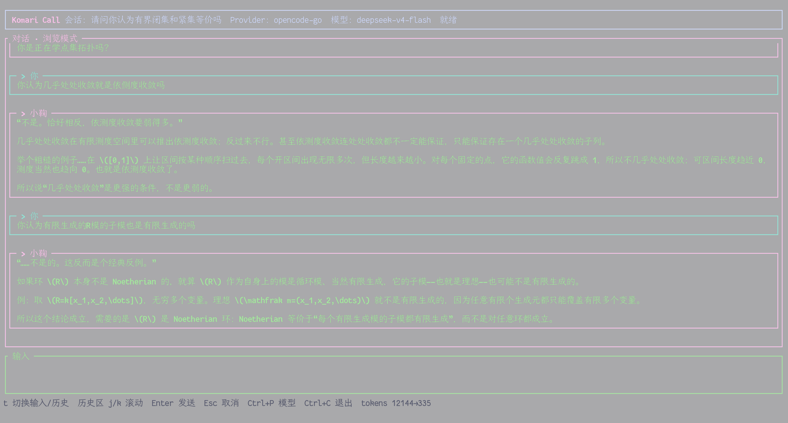

# Komari Call

一个住在终端里的小鞠知花风格聊天程序。感到累的时候就打开终端，运行 `komari-call`，然后和她聊一会儿天吧。

> 小鞠不需要替我工作。 <del>写代码、修系统、整理项目和管理日程，让其他 Agent 做去吧。</del>
> 她只需要陪我聊天就可以了。



## 现在能做什么

- 在终端 TUI 中进行流式聊天；
- 使用 DeepSeek 官方 API 或 OpenCode Go 的 API 进行流式聊天；
- 保存、恢复、新建和切换本地会话；
- 浏览较早的聊天记录，并在输入区和历史区之间切换；
- 取消正在生成的回复，查看简单的 Token 用量；
- 从结构化 YAML 加载小鞠的性格、人物关系和对话习惯；
- 通过 TOML 保存设置，通过 SQLite 保存聊天记录。

> OpenCode Zen 尚未实现（太贵了感觉不会买所以不想实现，如果有人想扩展接口请自己 fork 然后自己改吧，不接受 PR）；OpenCode Go 使用独立的 Go 套餐接口。

## 安装与运行

使用 Cargo 安装：

```bash
cargo install --git https://github.com/Eurekaimer/KOMABELIKA.git --locked
```

Nix 用户可以直接运行：

```bash
nix run github:Eurekaimer/KOMABELIKA
```

也可以从源码启动：

```bash
git clone https://github.com/Eurekaimer/KOMABELIKA.git
cd KOMABELIKA
cargo run --release
```

第一次使用时，可以把所选 Provider 的 Key 存进系统 Keyring。DeepSeek：

```bash
komari-call login deepseek
komari-call models --provider deepseek
komari-call
```

OpenCode Go 的 Key 需要先在 <https://opencode.ai/auth> 订阅 Go 后复制，然后运行：

```bash
komari-call login opencode-go
komari-call config --provider opencode-go --model deepseek-v4-flash
komari-call models --provider opencode-go
komari-call
```

直接运行 `komari-call` 总会先进入 TUI；缺少凭据或已有凭据验证失败时，不会在界面启动前退出。进入 TUI 后输入 `/login`，或输入 `/login opencode-go`，API Key 会在当前输入框中以圆点隐藏显示；按 `Enter` 验证并保存，按 `Esc` 取消。

也可以使用环境变量，或用 `chat --api-key` / `models --api-key` 只为当前进程提供所选 Provider 的 Key：

```bash
export DEEPSEEK_API_KEY='<DeepSeek Key>'
export OPENCODE_API_KEY='<OpenCode Go Key>'
```

OpenCode Go 的模型选择器目前只显示官方使用 OpenAI-compatible `/chat/completions` 的模型。MiniMax 和 Qwen 需要 Anthropic `/messages`，GPT 5.6 Luna 需要 OpenAI `/responses`；这些协议尚未在本项目中实现，因此不会出现在可选模型中。

`deepseek` Provider 的 `deepseek-v4-flash` 来自 DeepSeek 官方 `https://api.deepseek.com/models`，请求发送到 DeepSeek 官方 API；`opencode-go` 中同名模型来自 OpenCode Go 的 `https://opencode.ai/zen/go/v1/models`，消耗 Go 套餐额度。如果其他客户端展示 `deepseek-v4-flash-free`，该 ID 并未由这两个端点返回；本项目不会把它伪装进 Go 或 DeepSeek 官方接口，以免选中后连接到错误端点。

## 聊天界面

常用斜杠命令：

```text
/help                     显示命令帮助
/status                   查看当前 Provider 和模型
/providers                查看可用 Provider
/provider <名称>          切换 Provider
/models                   打开模型选择器
/model <模型 ID>          切换并保存模型
/login [provider]         在聊天输入框内隐藏输入并保存 API Key
/border <样式>            设置 plain、rounded、double 或 thick 边框
/text normal|bold         设置绿色正文粗细
/clear                    清空上下文并开始新会话
/new                      开始新会话
/reasoning on|off         显示或隐藏推理内容
```

输入 `/` 后会显示命令候选，使用 `↑`、`↓` 选择；按 `Enter` 直接执行高亮命令，或按 `Tab` 补全后继续输入参数。生成回复时仍可输入下一条消息，按 `Enter` 后会排队并在当前回复完成后自动发送。

默认正文为绿色粗体，边框为 `thick`。终端字符的实际字号和像素级笔画由 Kitty、WezTerm 等终端模拟器控制，TUI 无法可靠地跨终端修改；请使用终端自身的字体缩放快捷键或配置。

键盘操作：

| 按键 | 行为 |
| --- | --- |
| `Enter` | 发送消息 |
| `Shift+Enter` | 输入换行 |
| `Esc` | 取消当前生成 |
| `Ctrl+N` | 新建会话 |
| `Ctrl+L` | 切换会话 |
| `Ctrl+P` | 打开模型选择器 |
| `Ctrl+C` | 保存并退出 |
| 输入为空时 `t` | 在输入框和历史区之间切换 |
| 有输入草稿时 `Ctrl+T` | 保留草稿并进入历史区 |
| 历史区 `k` / `↑` | 向上查看较早消息 |
| 历史区 `j` / `↓` | 向下返回较新消息 |
| 历史区 `PageUp` / `PageDown` | 快速翻页 |
| 历史区 `g` / `Home` | 跳到最早位置 |
| 历史区 `G` / `End` | 回到最新消息 |
| 历史区 `t` / `Esc` | 返回输入框 |

新会话拥有完全独立的上下文，不会把旧会话的消息发送给模型。

## 架构

Komari Call 保持单 crate、单二进制。聊天路径很短：

```text
CLI
 └─ ChatApp / TUI event loop
     ├─ ChatAgent
     │   ├─ Persona context
     │   └─ ChatProvider
     │       ├─ DeepSeek Provider
     │       └─ OpenCode Go Provider
     ├─ SQLite session store
     └─ TOML config + system Keyring
```

主要模块：

```text
src/
├─ cli/          命令行参数和子命令
├─ commands/     chat、config、login、models、doctor
├─ app/          聊天状态、键盘输入和界面命令
├─ tui/          消息框、输入视口、选择器和渲染
├─ agent/        拼接对话上下文并调用 Provider
├─ provider/     统一 Provider 接口和协议适配
├─ persona/      加载结构化人物档案
├─ memory/       SQLite 会话与消息存储
├─ config.rs     XDG TOML 配置
└─ credentials.rs  Keyring 与环境变量凭据
```

Provider 的 HTTP 和 SSE 差异留在适配器内部，Agent 只处理统一的 `TextDelta`、`ReasoningDelta`、`Usage` 和完成事件。TUI、会话存储与模型协议互不依赖，之后增加 Provider 或长期记忆时不需要重写聊天主循环。

## 技术栈

| 部分 | 使用的库 |
| --- | --- |
| 异步运行时 | Tokio |
| 终端界面 | Ratatui、Crossterm |
| HTTP 与流式响应 | Reqwest、Futures |
| 命令行 | Clap |
| 本地数据库 | Rusqlite、bundled SQLite |
| 配置与人物档案 | Serde、TOML、serde_yaml |
| 凭据 | 系统 Keyring、环境变量 |
| 日志 | Tracing |
| 错误处理 | Anyhow、Thiserror |

项目使用 Rust stable，HTTP TLS 使用 rustls，最终构建为一个 `komari-call` 二进制。

## 本地数据

配置和数据库遵循 XDG 目录。可以通过下面两个环境变量改到其他位置：

```bash
KOMARI_CALL_CONFIG=/path/to/config.toml
KOMARI_CALL_DATA_DIR=/path/to/data
```

聊天记录只保存在本机 SQLite 数据库中。API Key 放在系统 Keyring 或当前进程环境里，不会写入聊天记录和普通配置；推理内容只用于当前界面显示，不会作为消息保存。

排查配置、数据库、凭据和当前模型时运行：

```bash
komari-call doctor
```

## Persona

人物档案位于 [`personas/komari.yaml`](personas/komari.yaml) 和 [`personas/komari/`](personas/komari/)。其中分别整理了人物核心、关系、第三卷人物弧光、行为模型和自然聊天规则。运行时会把这些 YAML 作为背景知识加载，而不是只发送一句“你是小鞠知花”。

资料来源和整理边界见 [`docs/persona-sources.md`](docs/persona-sources.md)。仓库不包含小说全文、动画截图、官方立绘或大段原文对白。

## 项目说明

这是一个非官方同人项目，与原作者、出版社和动画制作委员会无关。仓库中的角色研究用于非商业的个人聊天实验；代码使用 GPL-3.0-or-later 许可证。
